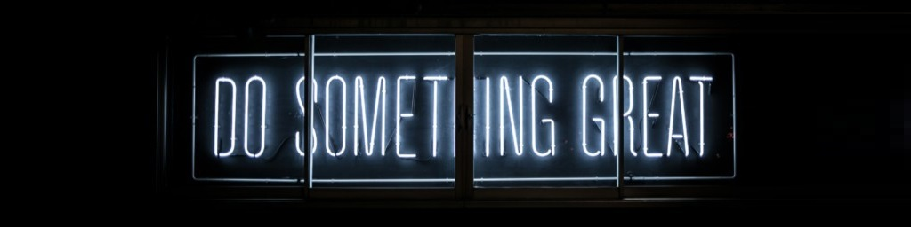

<h1 align="center">Hi  I'm Reza Tanakizadeh</h1>
<h3 align="center">I`m Signal-processing and Computer-vision Eng.</h3>

<!-- 
  
 -->

### more about me:
- 🏆 My exprience in [LinkedIn](https://www.linkedin.com/in/rezatz/) Page

- 📝 Sometimes I write Persian articles on [Commnet](http://mr-comment.ir/)

- 👨‍🎓 [Stackoverflow](https://stackoverflow.com/users/17739641/reza-tanakizadeh) Profile

- 📫 How to reach me **reza.tz780210@gmail.com**

### Research and working fields:

Signal processing 
+ Image processing specialist
+ Audio processing
+ signal processing on FPGA
+ DOA Estimation

AI
+ Computer vision
+ Machine learning approach
+ Augmented Reality
